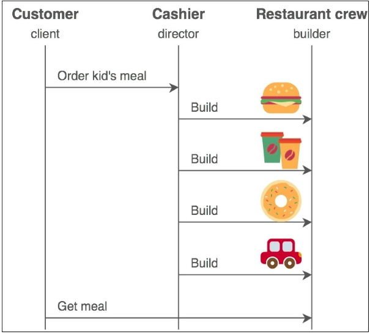

# 第二章 构造器模式
*****************

Imagine that we want to create an object that is composed of multiple parts and the composition needs to be done step by step. The object is not complete unless all its parts are fully created. That's where the Builder design pattern can help us. The Builder pattern separates the construction of a complex object from its representation. By keeping the construction separate from the representation, the same construction can be used to create several different representations [GOF95, page 110], [j.mp/builderpat].  

想象一下，我们想要一个由多个部分合成的对象，而且合成需要一步步的来操作。这个对象在其自身所有部分都完全创建之前是不完整的。这就是构造器模式能够帮助我们的地方。构造器模式通过自己的表现将一个复杂对象的构造进行分离。通过使用表现的构造分离，相同的构造介意被用到多个不同到表现上。  

A practical example can help us understand what the purpose of the Builder pattern is. Suppose that we want to create an HTML page generator, the basic structure (construction part) of an HTML page is always the same: it begins with <html> and finishes with </html>; inside the HTML section are the <head> and </head> elements, inside the head section are the <title> and </title> elements, and so forth. But the representation of the page can differ. Each page has its own title, its own headings, and different <body> contents. Moreover, the page is usually built in steps: one function adds the title, another adds the main heading, another the footer, and so on. Only after the whole structure of a page is complete can it be shown to the client using a final render function. We can take it even further and extend the HTML generator so that it can generate totally different HTML pages. One page might contain tables, another page might contain image galleries, yet another page contains the contact form, and so on.  

实际的例子可以帮助我们理解使用构造器的目的是什么。假设我们想要创建一个HTML页面生成器，基本的HTML页面结构都是相同的：以<html>开始并以</html>结束；内部HTML区域是<head>和</head>元素，内部头区域是<title>和</title>元素，等等。但是页面的表现又是不同的。每个页面都拥有自己的标题，自己的头，以及不同的<body>内容。此外，页面通常的组成有多个步骤：一个函数添加标题，另一个添加主要头部，另外一个添加footer，等等。仅在整个页面合成完毕后，才使用最后的渲染函数将页面显示给用户。我们可以做到跟进一步，去扩展HTML生成器，这样它就可以生成完全不同的HTML页面了。一个页面或许包含表格、一个页面可能含有图片展示，另外一个页面还可能包含联系人表单，等等。  

The HTML page generation problem can be solved using the Builder pattern. In this pattern, there are two main participants: the builder and the director. The builder
is responsible for creating the various parts of the complex object. In the HTML example, these parts are the title, heading, body, and the footer of the page. The director controls the building process using a builder instance. The HTML example means for calling the builder's functions for setting the title, the heading, and so on. Using a different builder instance allows us to create a different HTML page without touching any code of the director.  

HTML页面生成器的问题可以使用构造器模式来解决。在这个模式中有两个主要的参与元素：构造器和经手人。构造器负责创建负责对象的多个部分。在HTML示例中，这些部分为主题，头部，主体，以及页面脚注。经手人使用构造器实例控制构建过程。HTML的例子中的部分为，标题，头部，主体，以及页面注脚。管理者使用一个构造器实例来控制构建过程。HTML的例子意味着要调用构造器的函数来设置标题，头部，等等。使用不同的构造器实例可以让我们不接触任何管理器的代码便可以创建不同的HTML页面。  

## 真实的例子
The Builder design pattern is used in fast-food restaurants. The same procedure is always used to prepare a burger and the packaging (box and paper bag), even if there are many different kinds of burgers (classic, cheeseburger, and more) and different packages (small-sized box, medium-sized box, and so forth). The difference between a classic burger and a cheeseburger is in the representation, and not in the construction procedure. The director is the cashier who gives instructions about what needs to be prepared to the crew, and the builder is the person from the crew that takes care of the specific order. The following figure provided by *www. sourcemaking.com* shows a **Unified Modeling Language (UML)** sequence diagram of the communication that takes place between the customer (client), the cashier (director), and the crew (builder) when a kid's menu is ordered [j.mp/builderpat].  

构造器模式被用在了快餐店上。相同的步骤一直用在了准备汉堡和打包上（盒子、纸袋），即使存在不同类型的汉堡（原味，起司，等等）以及不同的包装（小号的盒子，中号的盒子，等等）原味汉堡和起司汉堡之间不同在于外观，而不是制造过程上。管理器是给全体工作人员发出需要准备什么食材的收银员，构造器是员工之中负责特殊订单的人。下面是由 *www. sourcemaking.com* 提供的 **Unified Modeling Language (UML)** 图片，它展示了当产生一份儿童餐订单时，一张放置于消费者（用户），收银员（管理器），和员工（构造器）之间的沟通顺序图解。  



## 与软件相关的例子
The HTML example that was mentioned at the beginning of the chapter is actually used by **django-widgy**, a third-party tree editor for Django that can be used as a **Content Management System (CMS)**. The django-widgy editor contains a page builder that can be used for creating HTML pages with different layouts [j.mp/widgypb].  

本章开始提到的HTML例子实际上是使用的是django-widgy，这是一个第三方的Django树形编辑器包，它能够当作CMS来使用。django-widgy包含了一个构造器，它能够用来创建不同布局的HTML页面。  

The **django-query-builder** library is another third-party Django library that relies on the Builder pattern. The django-query-builder library can be used for building SQL queries dynamically. Using this, we can control all aspects of a query and create a different range of queries, from simple to very complex [j.mp/djangowidgy].  

django-query-builder库是另外一个第三方的Django库，它依赖于构造器模式。django-query-builder库用来构建动态SQL查询。使用这个库，我们可以控制查询和创建一组不同查询的方方面面，从简单的到复杂都可以。  

## 使用案例
We use the Builder pattern when we know that an object must be created in multiple steps, and different representations of the same construction are required. These requirements exist in many applications such as page generators (like the HTML page generator mentioned in this chapter), document converters [GOF95, page 110], and User Interface (UI) form creators [j.mp/pipbuild].  

在我们知道对象必须用到多个步骤才能创建，以及需要相同构造的不同表现时才会使用构造器模式。这些需求存在于很多的应用中，比如页面生成器（类似于本章提到的页面生成器），文档转换器，以及用户界面（UI）的表单创建器。  

Some resources mention that the Builder pattern can also be used as a solution to the telescopic constructor problem [j.mp/wikibuilder]. The telescopic constructor problem occurs when we are forced to create a new constructor for supporting different ways of creating an object. The problem is that we end up with many constructors and long parameter lists, which are hard to manage. An example of the telescopic constructor is listed at the stackoverflow website [j.mp/sobuilder]. Fortunately, this problem does not exist in Python, because it can be solved in at least two ways:  

有些资料提到构造器模式也可以作为伸缩构造器问题的一个解决方案。当我们被迫创建一个新的构造器以支持一个对象的不同创建方式，便会出现伸缩构造器问题。其问题在于，在终结时我们还有很多的构造器和长参数列表，这将难以管理。伸缩构造器的例子被列在了stackoveflow网站。幸运的是，在Python这个问题并不存在，因为它是至少可以使用两种方法来解决：  

- With named parameters [j.mp/sobuipython]  
- With argument list unpacking [j.mp/arglistpy]  

- 使用命名参数  
- 使用参数列表解包

At this point, the distinction between the Builder pattern and the Factory pattern might not be very clear. The main difference is that a Factory pattern creates an object in a single step, whereas a Builder pattern creates an object in multiple steps, and almost always through the use of a director. Some targeted implementations of the Builder pattern like Java's **StringBuilder** bypass the use of a director, but that's the exception to the rule.  

在这一阶段，构造器模式和工厂模式之间的区别并不非常明显。主要的区别在于工厂模式以单步形式创建一个对象，而构造器模式则以踱步形式创建一个对象，并且几乎都是通过管理者的使用来实现的。一些以构造器模式为主要目标的实现，比如Java的**StringBuilder** 就忽略了管理者的使用，不过这是个例外。  

Another difference is that while a Factory pattern returns a created object immediately, in the Builder pattern the client code explicitly asks the director
to return the final object when it needs it [GOF95, page 113], [j.mp/builderpat].  

另外一个区别是工厂模式立即返回创建的对象，而在构造器模式中用户代码显式地向经理人请求，在有需要时返回最终的对象。  

The new computer analogy might help to distinguish between a Builder pattern and a Factory pattern. Assume that you want to buy a new computer. If you decide to buy a specific preconfigured computer model, for example, the latest Apple 1.4 GHz Mac mini, you use the Factory pattern. All the hardware specifications are already predefined by the manufacturer, who knows what to do without consulting you. The manufacturer typically receives just a single instruction. Code-wise, this would look like the following (*apple-factory.py*):  

新计算机的分析有助于区别构造器模式和工厂模式。假设你需要买一台新电脑。如果你决定买预先配置好的电脑，例如最新的Apple 1.4Ghz Mac mini，你使用的是工厂模式。所有硬件规格都已经由厂商预定义了，厂家不用问你也知道该干什么。厂商通常只会收到一条指令。代码使人明了，其内容如下（*apple-factory.py*）：  

```python
MINI14 = '1.4GHz Mac mini'


class AppleFactory:
   class MacMini14:
       def __init__(self):
           self.memory = 4 # in gigabytes 使用吉字节表示
           self.hdd = 500 # in gigabytes 使用吉字节表示
           self.gpu = 'Intel HD Graphics 5000'

       def __str__(self):
           info = ('Model: {}'.format(MINI14),
                   'Memory: {}GB'.format(self.memory),
                   'Hard Disk: {}GB'.format(self.hdd),
                   'Graphics Card: {}'.format(self.gpu))
           return '\n'.join(info)

       def build_computer(self, model):
          if (model == MINI14):
             return self.MacMini14()
          else:
             print("I don't know how to build {}".format(model))

if __name__ == '__main__':
       afac = AppleFactory()
       mac_mini = afac.build_computer(MINI14)
       print(mac_mini)
```

>#### 注释
>Notice the nested *MacMini14 class*. This is a neat way of forbidding the direct instantiation of a class.  
>注意嵌套的*MacMini14 class*。  

Another option is buying a custom PC. In this case, you use the Builder pattern. You are the director that gives orders to the manufacturer (builder) about
your ideal computer specifications. Code-wise, this looks like the following (*computer-builder.py*):   

另外一个选择买一台定制的PC。在这个例子中，你可以使用构造器模式。你是给制造商（builder）下发个人定制电脑的经理人。关于代码，其内容如下（*computer-builder.py*）：  

```python
class Computer:
    def __init__(self, serial_number):
       self.serial = serial_number
       self.memory = None      # in gigabytes 使用吉字节表示
       self.hdd = None         # in gigabytes 使用吉字节表示
       self.gpu = None
    def __str__(self):
       info = ('Memory: {}GB'.format(self.memory),
               'Hard Disk: {}GB'.format(self.hdd),
               'Graphics Card: {}'.format(self.gpu))
       return '\n'.join(info)


class ComputerBuilder:
    def __init__(self):
        self.computer = Computer('AG23385193')
    def configure_memory(self, amount):
        self.computer.memory = amount
    def configure_hdd(self, amount):
        self.computer.hdd = amount
    def configure_gpu(self, gpu_model):
        self.computer.gpu = gpu_model
        

class HardwareEngineer:
    def __init__(self):
        self.builder = None
        
    def construct_computer(self, memory, hdd, gpu):
           self.builder = ComputerBuilder()
           [step for step in (self.builder.configure_memory(memory),
                              self.builder.configure_hdd(hdd),
                              self.builder.configure_gpu(gpu))]

     @property
     def computer(self):
         return self.builder.computer


def main():
    engineer = HardwareEngineer()
    engineer.construct_computer(hdd=500, memory=8, gpu='GeForce GTX 650 Ti')
    computer = engineer.computer
    print(computer)
       
if __name__ == '__main__':
    main()
```


The basic changes are the introduction of a builder *ComputerBuilder*, a director *HardwareEngineer*, and the step-by-step construction of a computer, which now supports different configurations (notice that *memory*, *hdd*, and *gpu* are parameters and not preconfigured). What do we need to do if we want to support the construction of tablets? Implement this as an exercise.  

基本的改变是构造器*ComputerBuilder*的命令，管理器*HardwareEngineer*，以及发具体命令的计算机，现在计算机可以支持不同的配置（注意参数memory，hdd，和gpu都未预先配置）。如果我们想要支持平板的质量该怎么做呢？你把实现这个目标当作练习。  

You might also want to change the computer *serial_number* into something that is different for each computer, because as it is now it means that all computers will have the same serial number (which is impractical).  

你或许想过为每台电脑更改为不同的“序列号”，因为这样，现在就意味着所有的点都拥有相同的序列号了（这也是不切实际的）。  

## Implementation 实现
Let's see how we can use the Builder design pattern to make a pizza ordering application. The pizza example is particularly interesting because a pizza is prepared in steps that should follow a specific order. To add the sauce, you first need to prepare the dough. To add the topping, you first need to add the sauce. And you can't start baking the pizza unless both the sauce and the topping are placed on the dough. Moreover, each pizza usually requires a different baking time, depending
on the thickness of its dough and the topping used.  

让我们来看一看，我们该如何使用构造器模式来编写一个披萨下单应用。披萨示例非常有趣，因为披萨要按照指定的订单一步一步地准备。要添加酱料的话，首先你需要准备生面团。要添加浇头，首先你需要放酱料。除非你把酱料和浇头都放到生面团上面否则你是没办法烘培披萨的。此外，通常，视面饼的厚度和浇头的使用，每个披萨都需要的不同的烘培时间。  

We start with importing the required modules and declaring a few Enum parameters [j.mp/pytenum] plus a constant that are used many times in the application. The STEP_DELAY constant is used to add a time delay between the different steps of preparing a pizza (prepare the dough, add the sauce, and so on) as follows:  

我们从导入所需的模块开始，然后声明了几个Enum参数[j.mp/pytenum]，添加了在应用中多次应用的常量。如下， STEP_DELAY常量被用来在准备披萨（准备生面团，添加酱料，等等）的不同步骤中添加一个时间延迟：  

```python
from enum import Enum
    PizzaProgress = Enum('PizzaProgress', 'queued preparation baking ready')
    PizzaDough = Enum('PizzaDough', 'thin thick')
    PizzaSauce = Enum('PizzaSauce', 'tomato creme_fraiche')
    PizzaTopping = Enum('PizzaTopping', 'mozzarella double_mozzarell bacon ham mushrooms red_onion oregano')
    STEP_DELAY = 3                  # in seconds for the sake of the example
```

Our end product is a *pizza*, which is described by the *Pizza* class. When using the Builder pattern, the end product does not have many responsibilities, since it is
not supposed to be instantiated directly. A builder creates an instance of the end product and makes sure that it is properly prepared. That is why the *Pizza* class is so minimal. It basically initializes all data to sane default values. An exception is the *prepare_dough()* method. The *prepare_dough()* method is defined in the *Pizza* class instead of a builder for two reasons:

我们最终的产品是‘披萨’，它由*Pizza*类描述。在使用构造器模式时，终端产品并没有太多的责任，因为它不支持直接实例化。构造器创建终端产品的实例，以保证披萨正确备料了。这就是为什么*Pizza*类这么细小的原因。基本上这个类初始化所有数据，以唤醒默认值。处理异常的方法是*prepare_dough()*。*prepare_dough()*方法定义在了*Pizza*类而不是构造器中有两个理由：  

- To clarify the fact that the end product is typically minimal does not mean that you should never assign it any responsibilities  
- To promote code reuse through composition [GOF95, page 32]  

- 要说明的是，终端产品通常是最小化的，但是这并不意味着你从此就不能让它承担任何的职责
- 通过使用合成来提升代码的复用性

```python
class Pizza:
    def __init__(self, name):
      self.name = name
      self.dough = None
      self.sauce = None
      self.topping = []

    def __str__(self):
      return self.name
      
    def prepare_dough(self, dough):
      self.dough = dough
      print('preparing the {} dough of your {}...'.format(self.dough.name, self))
      time.sleep(STEP_DELAY)
      print('done with the {} dough'.format(self.dough.name))
          
```

There are two builders: one for creating a margarita pizza (*MargaritaBuilder*) and another for creating a creamy bacon pizza (*CreamyBaconBuilder*). Each builder creates a Pizza instance and contains methods that follow the pizza-making procedure: *prepare_dough()*, *add_sauce()*, *add_topping()*, *and bake()*. To be precise, *prepare_dough()* is just a wrapper to the *prepare_dough()* method of the *Pizza* class. Notice how each builder takes care of all the pizza-specific details. For example, the topping of the margarita pizza is *double mozzarella* and *oregano*, while the topping of the creamy bacon pizza is *mozzarella*, *bacon*, *ham*, *mushrooms*, *red onion*, and *oregano* as follows:  

有两个构造器：一个用来创建玛格丽塔披萨（*MargaritaBuilder*），另外一个用来创建奶油培根披萨（*CreamyBaconBuilder*）。每个构造器创建一个Pizza实例，以及包含了遵循披萨制作流程的方法：*prepare_dough()*, *add_sauce()*, *add_topping()*, *and bake()*。准确地来说，*prepare_dough()*只是一个应用于*Pizza*类的方法*prepare_dough()*的包装器。请注意每个构造器是如何处理定制披萨的细节。例如，马格丽特披萨的浇头是‘双份白干奶酪’和‘牛至叶’，而奶油培根披萨的浇头则是‘白干奶酪’，‘培根’，‘火腿’，‘蘑菇’，‘紫皮洋葱’，和‘牛至叶’，一如下面所示：  

```python
class MargaritaBuilder:
    def __init__(self):
       self.pizza = Pizza('margarita')
       self.progress = PizzaProgress.queued
       self.baking_time = 5      # in seconds for the sake of the example
                                  # 因为考虑到示例所以这里使用了秒
    def prepare_dough(self):
       self.progress = PizzaProgress.preparation
       self.pizza.prepare_dough(PizzaDough.thin)
    def add_sauce(self):
       print('adding the tomato sauce to your margarita...')
       self.pizza.sauce = PizzaSauce.tomato
       time.sleep(STEP_DELAY)
       print('done with the tomato sauce')
    def add_topping(self):
       print('adding the topping (double mozzarella, oregano) to your margarita')
       self.pizza.topping.append([i for i in
       (PizzaTopping.double_mozzarella, PizzaTopping.oregano)])
       time.sleep(STEP_DELAY)
       print('done with the topping (double mozzarella, oregano)')
    def bake(self):
       self.progress = PizzaProgress.baking
       print('baking your margarita for {} seconds'.format(self.baking_time))
       time.sleep(self.baking_time)
       self.progress = PizzaProgress.ready
       print('your margarita is ready')


class CreamyBaconBuilder:
    def __init__(self):
       self.pizza = Pizza('creamy bacon')
       self.progress = PizzaProgress.queued
       self.baking_time = 7      # in seconds for the sake of the example
    def prepare_dough(self):
       self.progress = PizzaProgress.preparation
       self.pizza.prepare_dough(PizzaDough.thick)
    def add_sauce(self):
       print('adding the crème fraîche sauce to your creamy bacon')
       self.pizza.sauce = PizzaSauce.creme_fraiche
       time.sleep(STEP_DELAY)
       print('done with the crème fraîche sauce')
    def add_topping(self):
       print('adding the topping (mozzarella, bacon, ham, mushrooms, red onion, oregano) to your creamy bacon')
       self.pizza.topping.append([t for t in
       (PizzaTopping.mozzarella, PizzaTopping.bacon,
       PizzaTopping.ham,PizzaTopping.mushrooms,
       PizzaTopping.red_onion, PizzaTopping.oregano)])
       time.sleep(STEP_DELAY)
       print('done with the topping (mozzarella, bacon, ham, mushrooms, red onion, oregano)')
    def bake(self):
       self.progress = PizzaProgress.baking
       print('baking your creamy bacon for {} seconds'.format(self.baking_time))
       time.sleep(self.baking_time)
       self.progress = PizzaProgress.ready
       print('your creamy bacon is ready')
```

The director in this example is the waiter. The core of the *Waiter* class is the *construct_pizza()* method, which accepts a builder as a parameter and executes all the pizza preparation steps in the right order. Choosing the appropriate builder, which can even be done in runtime, gives us the ability to create different pizza styles without modifying any code of the director (*Waiter*). The Waiter class also contains the *pizza()* method, which returns the end product (prepared pizza) as a variable to the caller as follows:  

这个例子中的管理器是服务员。*Waiter*类的核心是*construct_pizza()*方法，这个方法接受一个构造器并作为参数，然后按照正确的顺序执行所有的披萨预备工作。选择合适的构造器，甚至可以在运行时实现，构造器给予我们能够不用修改管理器（Waiter）的任何代码就可以常见不同风味的披萨。

```python
class Waiter:
     def __init__(self):
         self.builder = None
     def construct_pizza(self, builder):
         self.builder = builder
         [step() for step in (builder.prepare_dough,
         builder.add_sauce, builder.add_topping, builder.bake)]
     @property
     def pizza(self):
         return self.builder.pizza
```


The *validate_style()* function is similar to the *validate_age()* function as described in Chapter 1, The Factory Pattern. It is used to make sure that the user gives valid input, which in this case is a character that is mapped to a pizza builder. The m character uses the *MargaritaBuilder* class and the c character uses the *CreamyBaconBuilder* class. These mappings are in the builder parameter. A tuple is returned, with the first element set to *True* if the input is valid, or *False* if it is invalid as follows:   

*validate_style()*函数类似于在第一章－工厂模式中描述过的*validate_age()*函数。它用来保证用户给出有效的输入，而在这个例子它是一个映射到披萨供应商的字符。字符m使用的*MargaritaBuilder*类，字符c使用*CreamyBaconBuilder*类。

```python
def validate_style(builders):
    try:
        pizza_style = input('What pizza would you like,[m]argarita or [c]reamy bacon? ')
        builder = builders[pizza_style]()
        valid_input = True
    except KeyError as err:
        print('Sorry, only margarita (key m) and creamy bacon (key c) are available')
        return (False, None)
    return (True, builder)
```


The last part is the *main()* function. The main() function contains a code for instantiating a pizza builder. The pizza builder is then used by the Waiter director for preparing the pizza. The created pizza can be delivered to the client at any later point:  

最后部分是*main()*函数。main()函数包含了初始化披萨构造器的代码。披萨构造器之后被Waiter经理人用来预备披萨。创建的披萨可以在之后的任意时刻送达用户：  

```python
def main():
    builders = dict(m=MargaritaBuilder, c=CreamyBaconBuilder)
    valid_input = False
    while not valid_input:
       valid_input, builder = validate_style(builders)
    print()
    waiter = Waiter()
    waiter.construct_pizza(builder)
    pizza = waiter.pizza
    print()
    print('Enjoy your {}!'.format(pizza))
```

To put all these things together, here's the complete code of this example (*builder.py*):  

将所有代码放在一起，下面是该例子（*builder.py*）的完整代码：  

```python
from enum import Enum


import time
   PizzaProgress = Enum('PizzaProgress', 'queued preparation baking ready')
   PizzaDough = Enum('PizzaDough', 'thin thick')
   PizzaSauce = Enum('PizzaSauce', 'tomato creme_fraiche')
   PizzaTopping = Enum('PizzaTopping', 'mozzarella double_mozzarella bacon ham mushrooms red_onion oregano')

STEP_DELAY = 3


class Pizza:
    def __init__(self, name):
        self.name = name
        self.dough = None
        self.sauce = None
        self.topping = []
        
    def __str__(self):
        return self.name
        
    # in seconds for the sake of the
    def prepare_dough(self, dough):
        self.dough = dough
        print('preparing the {} dough of your {}...'.format(self.dough.name, self))
        time.sleep(STEP_DELAY)
        print('done with the {} dough'.format(self.dough.name))


class MargaritaBuilder:
    def __init__(self):
        self.pizza = Pizza('margarita')
        self.progress = PizzaProgress.queued
        self.baking_time = 5      # in seconds for the sake of the
        
    def prepare_dough(self):
        self.progress = PizzaProgress.preparation
        self.pizza.prepare_dough(PizzaDough.thin)
        
    def add_sauce(self):
        print('adding the tomato sauce to your margarita...')
        self.pizza.sauce = PizzaSauce.tomato
        time.sleep(STEP_DELAY)
        print('done with the tomato sauce')
        
    def add_topping(self):
        print('adding the topping (double mozzarella, oregano) to your margarita')
        self.pizza.topping.append([i for i in
        (PizzaTopping.double_mozzarella, PizzaTopping.oregano)])
        time.sleep(STEP_DELAY)
        print('done with the topping (double mozzarrella, oregano)')
    
    def prepare_dough(self):
        self.progress = PizzaProgress.preparation
        self.pizza.prepare_dough(PizzaDough.thin)
        
    def add_sauce(self):
        print('adding the tomato sauce to your margarita...')
        self.pizza.sauce = PizzaSauce.tomato
        time.sleep(STEP_DELAY)
        print('done with the tomato sauce')
        
    def add_topping(self):
        print('adding the topping (double mozzarella, oregano) to your margarita')
        self.pizza.topping.append([i for i in
        (PizzaTopping.double_mozzarella, PizzaTopping.oregano)])
        time.sleep(STEP_DELAY)
        print('done with the topping (double mozzarrella, oregano)')
    
    
class CreamyBaconBuilder:
    def __init__(self):
        self.pizza = Pizza('creamy bacon')
        self.progress = PizzaProgress.queued
        self.baking_time = 7      # in seconds for the sake of the
    
    def prepare_dough(self):
        self.progress = PizzaProgress.preparation
        self.pizza.prepare_dough(PizzaDough.thick)
           
    def add_sauce(self):
        print('adding the crème fraîche sauce to your creamy bacon')
        self.pizza.sauce = PizzaSauce.creme_fraiche
        time.sleep(STEP_DELAY)
        print('done with the crème fraîche sauce')
           
    def add_topping(self):
        print('adding the topping (mozzarella, bacon, ham, mushrooms, red onion, oregano) to your creamy bacon')
        self.pizza.topping.append([t for t in
        (PizzaTopping.mozzarella, PizzaTopping.bacon,
        PizzaTopping.ham,PizzaTopping.mushrooms,
        PizzaTopping.red_onion, PizzaTopping.oregano)])
        time.sleep(STEP_DELAY)
        print('done with the topping (mozzarella, bacon, ham, mushrooms, red onion, oregano)')
           
    def bake(self):
        self.progress = PizzaProgress.baking
        print('baking your creamy bacon for {} seconds'.format(self.baking_time))
        time.sleep(self.baking_time)
        self.progress = PizzaProgress.ready
        print('your creamy bacon is ready')
    
    
class Waiter:
    def __init__(self):
        self.builder = None
    def construct_pizza(self, builder):
        self.builder = builder
        [step() for step in (builder.prepare_dough,
        builder.add_sauce, builder.add_topping, builder.bake)]
    @property
    def pizza(self):
        return self.builder.pizza
    def validate_style(builders):
        try:
            pizza_style = input('What pizza would you like,[m]argarita or [c]reamy bacon? ')
            builder = builders[pizza_style]()
            valid_input = True
        except KeyError as err:
            print('Sorry, only margarita (key m) and creamy bacon (key c) are available')
            return (False, None)
        return (True, builder)


def main():
       builders = dict(m=MargaritaBuilder, c=CreamyBaconBuilder)
       valid_input = False
       while not valid_input:
           valid_input, builder = validate_style(builders)
       print()
       waiter = Waiter()
       waiter.construct_pizza(builder)
       pizza = waiter.pizza
       print()
       print('Enjoy your {}!'.format(pizza))
   if __name__ == '__main__':
       main()
```

A sample output of this example is as follows:  

这个例子的输出如下：  

```python
>>> python3 builder.py
What pizza would you like, [m]argarita or [c]reamy bacon? r
Sorry, only margarita (key m) and creamy bacon (key c) are available
What pizza would you like, [m]argarita or [c]reamy bacon? m
preparing the thin dough of your margarita...
done with the thin dough
adding the tomato sauce to your margarita...
done with the tomato sauce
adding the topping (double mozzarella, oregano) to your margarita
done with the topping (double mozzarella, oregano)
baking your margarita for 5 seconds
your margarita is ready
Enjoy your margarita!
```

Supporting only two pizza types is a shame. Implement a Hawaiian pizza builder. Consider using inheritance after thinking about the advantages and disadvantages. Check the ingredients of a typical Hawaiian pizza and decide which class you need to extend: *MargaritaBuilder* or *CreamyBaconBuilder*? Perhaps both [j.mp/pymulti]?  

只能支持两种披萨类型是种耻辱。我们要实现一个夏威夷披萨生产商。在考虑了优缺点之后，我们决定使用继承。

In the book, Effective Java (2nd edition), Joshua Bloch describes an interesting variation of the Builder pattern where calls to builder methods are chained. This is accomplished by defining the builder itself as an inner class and returning itself from each of the setter-like methods on it. The *build()* method returns the final object. This pattern is called the Fluent Builder. Here's a Python implementation, which
was kindly provided by a reviewer of the book:  

在高效Java（第二版）这本书中，作者Joshua Bloch描述了

```python
class Pizza:
       def __init__(self, builder):
           self.garlic = builder.garlic
           self.extra_cheese  = builder.extra_cheese
       def __str__(self):
           garlic = 'yes' if self.garlic else 'no'
           cheese = 'yes' if self.extra_cheese else 'no'
           info = ('Garlic: {}'.format(garlic),
               'Extra cheese: {}'.format(cheese))
           return '\n'.join(info)
       class PizzaBuilder:
           def __init__(self):
               self.extra_cheese = False
               self.garlic = False
           def add_garlic(self):
               self.garlic = True
               return self
           def add_extra_cheese(self):
               self.extra_cheese = True
               return self
           def build(self):
               return Pizza(self)
   if __name__ == '__main__':
       pizza =
       Pizza.PizzaBuilder().add_garlic().add_extra_cheese().build()
       print(pizza)
  ```
  
Adapt the pizza example to make use of the Fluent Builder pattern. Which version of the two do you prefer? What are the pros and cons of each version?  
  
## 总结
In this chapter, we have seen how to use the Builder design pattern. We use the Builder pattern for creating an object in situations where using the Factory pattern (either a Factory Method or an Abstract Factory) is not a good option. A Builder pattern is usually a better candidate than a Factory pattern when:  

- We want to create a complex object (an object composed of many parts and created in different steps that might need to follow a specific order). 
- Different representations of an object are required, and we want to keep the construction of an object decoupled from its representation 
- We want to create an object at one point in time but access it at a later point

- 我们想创建一个复杂的对象（对象由很多部分合成，而且按照不同的步骤创建，这就需要遵循一个特定的顺序）。 
- 
- 

We saw how the Builder pattern is used in fast-food restaurants for preparing meals, and how two third-party Django packages, django-widgy and django-query- builder, use it for generating HTML pages and dynamic SQL queries, respectively. We focused on the differences between a Builder pattern and a Factory pattern, and gave a preconfigured (Factory) versus customer (Builder) computer order analogy to clarify them.  

我们见过了在快餐店如何使用构造器来为备餐服务，以及两个第三方店Django，django-widgy 和 django-query- builder如何分别地被用来生成HTML页面和动态的SQL查询。我们关注了构造器模式和工厂模式之间的区别，  

In the implementation part, we have seen how to create a pizza ordering application, which has preparation dependencies. There are many recommended interesting exercises in this chapter, including implementing a Fluent Builder.  

在实现部分，我们见到了如何创建一个披萨订餐应用，这个应用有一些前置以来。在这一章，推荐了很多有趣的联系，其中就包括实现一个流体构造器。  

In the next chapter, you will learn about the last creational design pattern covered in this book: the Prototype pattern, which is used for cloning an object.  

在下一章，你会学习到


