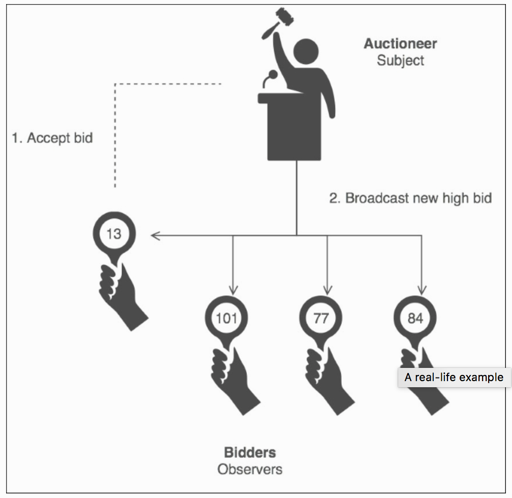
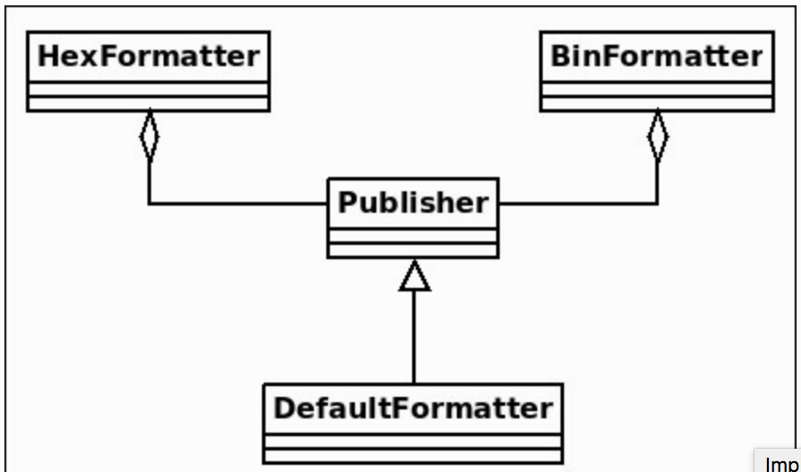

第十三章－观察者模式 The Observer Pattern
**************************************
Sometimes, we want to update a group of objects when the state of another
object changes. A very popular example lies in the Model-View-Controller (MVC) pattern. Assume that we are using the data of the same model in two views, for instance in a pie chart and in a spreadsheet. Whenever the model is modified,
both the views need to be updated. That's the role of the Observer design pattern [Eckel08, page 213].  

有时候，我们想要在另外一个对象改变时更新一组对象。一个非常流行的例子就是模型－视图－控制器（MVC）模式。假设，我们在两个视图中使用了相同模型的数据，比如，一个表格中的饼状图。不论模型是否被修改，这两个视图都需要更新。这正是观察者设计模式所扮演的角色。  

The Observer pattern describes a publish-subscribe relationship between a single object, : the publisher, which is also known as the subject or observable, and one or more objects, : the subscribers, also known as observers. In the MVC example, the publisher is the model and the subscribers are the views. However, MVC is not the only publish-subscribe example. Subscribing to a news feed such as RSS or Atom is another example. Many readers can subscribe to the feed typically using a feed reader, and every time a new item is added, they receive the update automatically.  

观察者模式描述了单一对象之间的发布－订阅关系，发布者也称作主题或者可观察对象，并且拥有一个或者更多的对象，订阅者，也称作观察者。在MVC例子中，发布者为模型，订阅者为视图。不过，MVC并不是唯一的发布－订阅例子。订阅新闻聚合，比如RSS或者Atom就是另外一个例子了。很多读者通常使用资源阅读器订阅资源，每次添加新资源时，他们都可以自动地收到更新。  

The ideas behind Observer are the same as the ideas behind MVC and the separation of concerns principle, that is, to increase decoupling between the publisher and subscribers, and to make it easy to add/remove subscribers at runtime. Additionally, the publisher is not concerned about who its observers are. It just sends notifications to all the subscribers [GOF95, page 327].  

观察者背后的思想是和MVC背后的思想以及关注原则的分离是相同的，即，加强发布者和订阅者之间的耦合拆解，并在运行时可以很容易地添加／删除订阅者。此外，发布者并不关心自己的观察者是谁。它只会把通知发送给全部的订阅者。  

## A real-life example 真实事例
In reality, an auction resembles Observer. Every auction bidder has a number paddle that is raised whenever they want to place a bid. Whenever the paddle is raised by a bidder, the auctioneer acts as the subject by updating the price of the bid and broadcasting the new price to all bidders (subscribers).  

在现实中，拍卖就很像观察者。每个拍卖投标者都拥一定数量的不论何时他们想要出价时要举起的报价牌。不论什么时候，报价牌被投标者举起时，拍卖主持人在更新投标价格时扮演者被监视对象的角色，同时会把新报价广播给全部的投标者（订阅者）。  

The following figure, courtesy of www.sourcemaking.com, [j.mp/observerpat], shows how the Observer pattern relates to an auction:  

下图，由www.sourcemaking.com赞助，它展示了观察者模式是如何关联到拍卖上面的：  


   
## A software example 软件示例
The django-observer package [j.mp/django-obs] is a third-party Django package that can be used to register callback functions that are executed when there are changes in several Django fields. Many different types of fields are supported (CharField, IntegerField, and so forth).  

django-observer包是一个第三方Django包，它用作在Django字段发生多处改变时注册被执行的回调函数。这个包支持很多不同类型的字段（CharField, IntegerField，等等）。  

RabbitMQ is a library that can be used to add asynchronous messaging support to an application. Several messaging protocols are supported, such as HTTP and AMQP. RabbitMQ can be used in a Python application to implement a publish-subscribe pattern, which is nothing more than the Observer design pattern [j.mp/rabbitmqobs].  

RabbitMQ 是一个可以用来对一个应用添加异步消息支持的库。它支持多种消息协议，比如HTTP和AMQP。RabbitMQ用在Python应用中可以实现发布－订阅模式，比起观察者设计模式它什么也是不。  

## Use cases 使用案例
We generally use the Observer pattern when we want to inform/update one or more objects (observers/subscribers) about a change that happened to another object (subject/publisher/observable). The number of observers as well as who the observers are may vary and can be changed dynamically (at runtime).  

我们一般在想要通知／更新一个或者更多对象有变更发生在了另外一个对象（主题／发布者／可订阅对象）身上。观察者的数量也随着观察者在改变，而且可以动态地改变（在运行时）。  

We can think of many cases where Observer can be useful. One such case was already mentioned at the start of this chapter: news feeds. Whether it is RSS, Atom, or another format, the idea is the same; you follow a feed, and every time it is updated, you receive a notification about the update [Zlobin13, page 60].  

我可以思考一下，在很多场合观察者都是非常有用的。其中一个此类场景在本章开始就已经提到了：新闻订阅。不论是RSS，Atom，或者其它格式，其思想都是一样的；你关注了订阅，每次订阅更新时，你就可以收到更新通知。  

The same concept exists in social networking. If you are connected to another person using a social networking service, and your connection updates something, you are notified about it. It doesn't matter if the connection is a Twitter user that you follow, a real friend on Facebook, or a business colleague on LinkedIn.  

同样的概念也存在社交网络中。如果你使用社交网络服务连接到了另外一个人，只要你的连接对象有内容更新，那么你也会得到通知。如果的连接的人是推特用户，脸书上的真实朋友，或者LinkedIn上的业务伙伴。  

Event-driven systems are another example where Observer can be (and usually is) used. In such systems, listeners are used to "listen" for specific events. The listeners are triggered when an event they are listening to is created. This can be typing a specific key (of the keyboard), moving the mouse, and more. The event plays the role of the publisher and the listeners play the role of the observers. The key point in this case is that multiple listeners (observers) can be attached to a single event (publisher) [j.mp/magobs].  

时间驱动的系统是另外一种情况，这里观察者也可（通常）被使用。在此类系统中，侦听者用来“侦听”特定的事件。这可以是特定（键盘）按键的键入，移动鼠标，等等。事件扮演了发布者的角色，侦听者扮演了观察者的角色。这种情况的关键点在于存在多个侦听者（以及观察者）加入到了单一的事件（发布者）中。  

## Implementation 实现
In this section, we will implement a data formatter. The ideas described here are based on the ActiveState Python Observer code recipe [j.mp/pythonobs]. There is a default formatter that shows a value in the decimal format. However, we
can add/register more formatters. In this example, we will add a hex and binary formatter. Every time the value of the default formatter is updated, the registered formatters are notified and take action. In this case, the action is to show the new value in the relevant format.  

在本节，我们要实现一个数据格式器。

Observer is actually one of the patterns where inheritance makes sense. We can have a base *Publisher* class that contains the common functionality of adding, removing, and notifying observers. Our DefaultFormatter class derives from Publisher
and adds the formatter-specific functionality. We can dynamically add and remove observers on demand. The following class diagram shows an instance of the example using two observers: *HexFormatter* and BinaryFormatter. Note that, because class diagrams are static, they cannot show the whole lifetime of a system, only the state of it at a specific point in time.  

观察者实际上是通过继承实现的模式其中一种。我们可以基本的*Publisher*类，它包含了常用的添加，移除，以及通知观察者的功能。我们的DefaultFormatter类派生自Publisher，而且添加了格式器专用的功能。我们可以按照需求动态地添加和移除观察者。下面的类图表展示了使用两个观察者例子的实例：*HexFormatter* 和BinaryFormatter。注意，因为类图表是静态的，所以它们不能够显示整个系统的生命周期内的东西，只展示了在特定时间内的部分状态。  



We begin with the Publisher class. The observers are kept in the observers list. The `add()` method registers a new observer, or throws an error if it already exists. The `remove()` method unregisters an existing observer, or throws an exception if it does not exist. Finally, the `notify()` method informs all observers about a change:  

我们从Publisher类开始。观察者保存在了observers列表中。`add()`方法注册了一个新的观察者，或者在观察者已经存在的情况下抛出一个错误。 `remove()`注销一个现有的观察者，或者在没有观察者存在时抛出一个异常。最后，`notify()`方法对所有的观察者通知变更的发生：  

```python
   class Publisher:
       def __init__(self):
           self.observers = []
       def add(self, observer):
           if observer not in self.observers:
               self.observers.append(observer)
           else:
               print('Failed to add: {}'.format(observer))
       def remove(self, observer):
           try:
               self.observers.remove(observer)
           except ValueError:
               print('Failed to remove: {}'.format(observer))
       def notify(self):
           [o.notify(self) for o in self.observers]
```

Let us continue with the DefaultFormatter class. The first thing that `__init__()` does is call `__init__()` method of the base class, since this is not done automatically in Python. A DefaultFormatter instance has name to make it easier for us to track its status. We use name mangling in the _data variable to state that it should not be accessed directly. Note that this is always possible in Python [Lott14, page 54] but fellow developers have no excuse for doing so, since the code already states that they should not. There is a serious reason for using name mangling in this case. Stay tuned. DefaultFormatter treats the _data variable as an integer, and the default value is zero:  

我们继续编写DefaultFormatter类。 `__init__()`做的第一件事就是屌用基类的 `__init__()`方法，因为在Python中这个操作并不会自动完成。DefaultFormatter实力拥有name，以便让我们更容易地跟踪它的状态。我们在_data变量中使用名称扭曲来声明这个变量不应该被直接访问。

```python
   class DefaultFormatter(Publisher):
       def __init__(self, name):
           Publisher.__init__(self)
           self.name = name
           self._data = 0
```


The `__str__()` method returns information about the name of the publisher and the value of `_data. type(self).__name__` is a handy trick to get the name of a class without hardcoding it. It is one of those things that make the code less readable but easier to maintain. It is up to you to decide if you like it or not:  

 `__str__()`方法返回发布者的名称信息， `_data. type(self).__name__`的值是一个获取类名称而不用硬编码的技巧。这是让代码可读性下降，但是易于维护的做法中其中一个。这样做，喜不喜欢完全由你自己决定：  

```python
   def __str__(self):
           return "{}: '{}' has data = {}".format(type(self).__name__, self.name, self._data)
```

There are two data() methods. The first one uses the @property decorator to give read access to the` _data` variable. Using this, we can just execute object.data instead of object.data():  

有两个data()方法。第一个方法使用@property装饰器给出了对` _data`变量的读访问。使用该装饰器，我们只要执行object.data而不是object.data()就行了。  

```python
       @property
       def data(self):
           return self._data
```

The second data() method is more interesting. It uses the @setter decorator, which is called every time the assignment (=) operator is used to assign a new value to the _data variable. This method also tries to cast a new value to an integer, and does exception handling in case this operation fails:  

第二个data()方法就更有意思了。它使用了 @setter 装饰器，该装饰器在每次赋值运算符（＝）用来将一个新值赋予_data变量时被屌用。该方法也试着把一个新值转换为整数，并在操作失败的情况下执行异常处理：  

```python
       @data.setter
       def data(self, new_value):
           try:
               self._data = int(new_value)
           except ValueError as e:
               print('Error: {}'.format(e))
          else:
               self.notify()
```

The next step is to add the observers. The functionality of HexFormatter and BinaryFormatter is very similar. The only difference between them is how they format the value of data received by the publisher, that is, in hexadecimal and binary, respectively:  

下一步是添加观察者。HexFormatter和BinaryFormatter的功能非常相似。唯一区别在于，它们之间如何格式化发布者接收到值，即，分别使用了十进制和二进制：  

```python
   class HexFormatter:
       def notify(self, publisher):
           print("{}: '{}' has now hex data = {}".format(type(self).__name__,
                     publisher.name, hex(publisher.data)))


   class BinaryFormatter:
       def notify(self, publisher):
           print("{}: '{}' has now bin data = {}".format(type(self).__name__,
                     publisher.name, bin(publisher.data)))
```

No example is fun without some test data. The main() function initially creates a DefaultFormatter instance named test1 and afterwards attaches (and detaches) the two available observers. Exception handling is also exercised to make sure that the application does not crash when erroneous data is passed by the user. Moreover, things such as trying to add the same observer twice or removing an observer that does not exist should cause no crashes:  

例子在离开测试数据后会显得毫无乐趣。main()函数初始化时创建了DefaultFormatter的命名为test1实例，之后附加（和移除）了两个可用的观察者。异常处理也被使用了，以保证用户在传输错误数据时不会让应用崩溃。此外，添加相同的观察者两次，或者移除一个不存在的观察者这类尝试并不会引起崩溃：  


```python
   def main():
       df = DefaultFormatter('test1')
       print(df)
		print()
		hf = HexFormatter()
		df.add(hf)
		df.data = 3
		print(df)
		print()
		bf = BinaryFormatter()
		df.add(bf)
		df.data = 21
		print(df)
		print()
       df.remove(hf)
       df.data = 40
       print(df)
       print()
       df.remove(hf)
       df.add(bf)
       df.data = 'hello'
       print(df)
       print()
       df.data = 15.8
       print(df)
```

Here's how the full code of the example (`observer.py`) looks:  

这里给出了下例子`observer.py`的完整代码：

```python
   class Publisher:
       def __init__(self):
           self.observers = []

       def add(self, observer):
           if observer not in self.observers:
               self.observers.append(observer)
           else:
               print('Failed to add: {}'.format(observer))

       def remove(self, observer):
           try:
               self.observers.remove(observer)
           except ValueError:
               print('Failed to remove: {}'.format(observer))

       def notify(self):
           [o.notify(self) for o in self.observers]


   class DefaultFormatter(Publisher):
       def __init__(self, name):
           Publisher.__init__(self)
           self.name = name
           self._data = 0

		  def __str__(self):
           return "{}: '{}' has data = {}".format(type(self).__name__, self.name, self._data)

       @property
       def data(self):
           return self._data

       @data.setter
       def data(self, new_value):
           try:
               self._data = int(new_value)
           except ValueError as e:
               print('Error: {}'.format(e))
           else:
               self.notify()


   class HexFormatter:
       def notify(self, publisher):
           print("{}: '{}' has now hex data = {}".format(type(self).__name__, publisher.name, hex(publisher.data)))


   class BinaryFormatter:
       def notify(self, publisher):
           print("{}: '{}' has now bin data = {}".format(type(self).__name__, publisher.name, bin(publisher.data)))


   def main():
       df = DefaultFormatter('test1')
       print(df)


print()
hf = HexFormatter()
df.add(hf)
df.data = 3
print(df)
print()
bf = BinaryFormatter()
df.add(bf)
df.data = 21
print(df)
print()
df.remove(hf)
df.data = 40
print(df)
print()
       df.remove(hf)
       df.add(bf)
       df.data = 'hello'
       print(df)
       print()
       df.data = 15.8
       print(df)
   if __name__ == '__main__':
       main()
```

Executing observer.py gives the following output:  

执行observer.py会输出下面的结果：  

```python
>>> python3 observer.py
DefaultFormatter: 'test1' has data = 0
HexFormatter: 'test1' has now hex data = 0x3
DefaultFormatter: 'test1' has data = 3
HexFormatter: 'test1' has now hex data = 0x15
BinaryFormatter: 'test1' has now bin data = 0b10101
DefaultFormatter: 'test1' has data = 21
BinaryFormatter: 'test1' has now bin data = 0b101000
DefaultFormatter: 'test1' has data = 40
Failed to remove: <__main__.HexFormatter object at 0x7f30a2fb82e8>
Failed to add: <__main__.BinaryFormatter object at 0x7f30a2fb8320>
Error: invalid literal for int() with base 10: 'hello'
BinaryFormatter: 'test1' has now bin data = 0b101000
DefaultFormatter: 'test1' has data = 40
BinaryFormatter: 'test1' has now bin data = 0b1111
DefaultFormatter: 'test1' has data = 15
```

What we see in the output is that as the extra observers are added, more (and relevant) output is shown, and when an observer is removed, it is not notified any longer. That's exactly what we want: runtime notifications that we are able to enable/disable on demand.  

我们所见的结果是，加入了额外的观察者，更多（相关的）输出结果被展示，当一个观察者被移除之后，不在会有任何的通知了。这正是我们想要的：对于运行时的通知，我们能够需求启用／禁用。  
  
The defensive programming part of the application also seems to work fine. Trying to do funny things such as removing an observer that does not exist or adding the same observer twice is not allowed. The messages shown are not very user-friendly but I leave that up to you as an exercise. Runtime failures of trying to pass a string when the API expects a number are also properly handled without causing the application to crash/terminate.  

应用的保护性程序部分看样子也运行良好。你可以试着做些有趣的事情，比如移除一个不存在的观察者，或者不被允许的相同观察者二次添加。消息显示并不十分友好，我把它留作你的练习题。

This example would be much more interesting if it were interactive. Even a simple menu that allows the user to attach/detach observers at runtime and modify the value of DefaultFormatter would be nice because the runtime aspect becomes much more visible. Feel free to do it.  

如果可以交互的话，这个例子会变的更加有趣。可以是一个简单的允许用户在运行时添加／移除观察者的按钮，修改DefaultFormatter的值也特别方便，因为运行层面变得更具有可访问性。有空的时候可以做一下。  

Another nice exercise is to add more observers. For example, you can add an octal formatter, a roman numeral formatter, or any other observer that uses your favorite representation. Be creative and have fun!  

另外一个不错的练习是添加更多的观察者。例如，你可以添加八进制格式器，罗马数字格式器，或者是其它的任何你想要表现的观察者。发挥你的创造性，然后享受在其中吧！  

## Summary
In this chapter, we covered the Observer design pattern. We use Observer when we want to be able to inform/notify all stakeholders (an object or a group of objects) when the state of an object changes. An important feature of observer is that the number of subscribers/observers as well as who the subscribers are may vary and can be changed at runtime.  

在本章，我们讨论了观察者设计模式。我们在想要在一个对象的状态改变时通知／提醒全部的参与者（一个对象，或者一组对象）。观察者的一个重要的功能是它

To understand Observer, you can think of an auction, with the bidders being the subscribers and the auctioneer being the publisher. This pattern is used quite a lot in the software world.  

要理解观察者，你可以想一想拍卖，投标人作为订阅者，而拍卖主持人则作为发布者。该模式在软件世界中被经常使用。  

In general, all systems that make use of the MVC pattern are event-based. As specific examples, we mentioned:  

通常，所有使用MVC模式的系统都是基于事件的。如指定的例子那样，我们提及的内容有：  

- django-observer, a third-party Django library used to register observers that are executed when fields are modified.  
- The Python bindings of RabbitMQ. We referred to a specific example of RabbitMQ used to implement the publish-subscribe (aka Observer) pattern.  

- django-observer，一个第三方的Django库，用来注册当字段被修改时要执行的观察者。
- RabbitMQ的Python绑定。我们用一个专门的RabbitMQ的例子来实现发布－订阅（也被称作观察者）模式。

In the implementation example, we saw how to use Observer to create data formatters that can be attached and detached at runtime to enrich the behavior of an object. Hopefully, you will find the recommended exercises interesting.  

在具体视线的例子中，我们看到了如何使用观察者创建能够在运行时添加或者移除一个对象的行为的数据格式器。但愿，你能找到练习题的乐趣所在。  

The next chapter introduces the State design pattern, which can be used to implement a core computer science concept: state machines.  

接下来的章节介绍了状态设计模式，它可以用来实现一个计算机科学概念的核心：状态机。  
